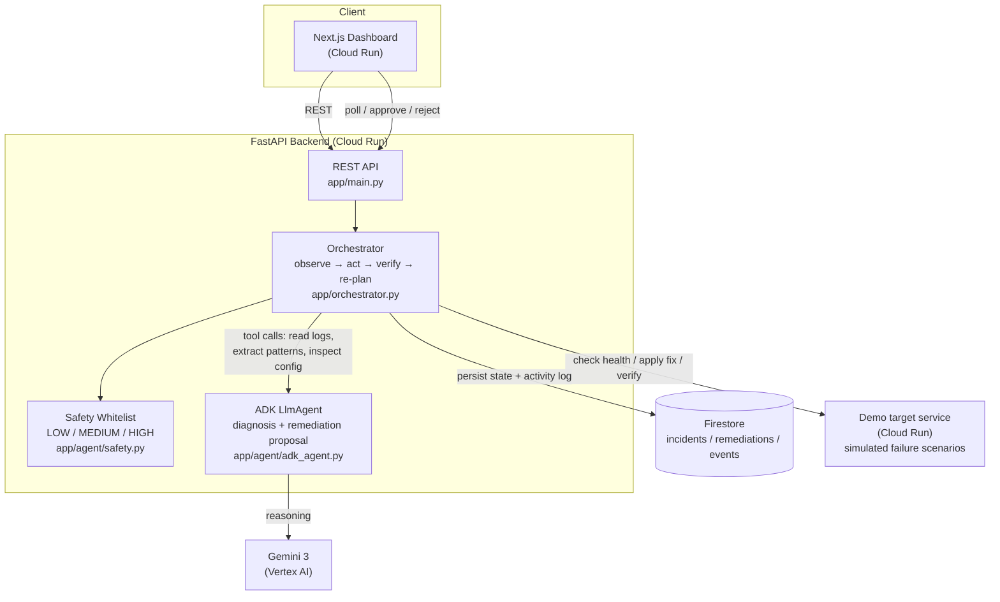

# Autonomous Incident Resolver Agent

> An autonomous AI agent that detects production incidents, investigates logs and
> service health, identifies likely root causes, proposes or performs safe
> remediation steps, and verifies recovery.

Built for the Google Cloud "All Things Agentic" hackathon — **Taskmaster** track.

The agent is not a log-summarizing chatbot. It runs a closed loop —
**observe → investigate → reason → act → verify → re-plan** — against a
whitelisted set of safe remediation actions, asking a human for approval on
anything above LOW risk and never auto-executing anything outside the
whitelist at all.

## Live demo

- Dashboard: https://incident-resolver-web-722901486266.us-central1.run.app
- API: https://incident-resolver-api-722901486266.us-central1.run.app
- Target service (the thing the agent watches over): https://incident-demo-service-722901486266.us-central1.run.app

## Architecture



**Why this shape:** the LLM (via ADK) is only trusted to *diagnose* and
*propose* a remediation — it calls read-only tools (logs, config, error
pattern extraction) to gather evidence, then reports a structured
`{root_cause, confidence, severity, action, reason}`. Every decision about
whether that `action` is safe to run, whether it needs human approval, and
what to do if it fails is made deterministically in `orchestrator.py` against
the whitelist in `safety.py` — the agent's own opinion of its action's risk
is never trusted.

## Repository layout

```
backend/          FastAPI + Google ADK agent + Firestore persistence
demo-service/      the "production service" the agent watches over — simulates
                    3 deterministic failure scenarios so the demo is reproducible
frontend/          Next.js dashboard (incident overview, approval UI, activity feed)
```

## Safety model

| Risk tier | Examples | Behavior |
|---|---|---|
| LOW | retry_service, rerun_health_check, gather_logs | Auto-executed immediately |
| MEDIUM | restore_env_var, rollback_revision, fix_dependency_config | Requires human approval before running |
| HIGH / unknown | delete_data, rotate_credentials, anything not whitelisted | **Never** auto-executed — incident is marked `escalation_required` for a human |

If a remediation is applied and verification shows the service still
unhealthy, the agent re-plans (tries the diagnosis again, excluding
previously-failed actions) up to a fixed attempt cap, after which it
escalates to a human rather than looping forever.

## Agent tools

Implemented in `backend/app/agent/tools.py`, wired into the ADK agent in
`backend/app/agent/adk_agent.py`:

- `check_service_health` / `verify_recovery` — health check (deterministic, called by the orchestrator, not the LLM)
- `read_recent_logs` — recent structured log entries from the target service
- `extract_error_patterns` — deterministic log-line grouping with a confidence score (no LLM)
- `inspect_service_config` — safe, non-secret config metadata
- `propose_remediation` (ADK tool, LLM-driven) — the agent's one required output: diagnosis + proposed whitelisted action
- `apply_safe_remediation` — executes the action against the target service
- `save_incident_state` — persisted via `app/incidents_store.py` + `app/agent/activity_log.py`

## Demo scenarios

The target service (`demo-service/main.py`) simulates three deterministic
failure modes so the loop is reproducible:

1. **Missing env var** — `DATABASE_URL` unset → fix: `restore_env_var`
2. **Broken dependency** — upstream `payments-api` failing → fix: `fix_dependency_config`
3. **Bad deployment** — new revision crash-looping → fix: `rollback_revision`

All three are MEDIUM risk in this MVP, so the dashboard will always show an
approval step — this is intentional: it's the safest default, and the demo
still shows the full observe → diagnose → act → verify loop once approved.

## Running locally

Requires: Python 3.12+, Node 20+, a GCP project with Vertex AI + Firestore
enabled, and `gcloud auth application-default login` run once.

### 1. Demo service (the target)

```bash
cd demo-service
python -m venv venv && venv/Scripts/activate  # or source venv/bin/activate on macOS/Linux
pip install -r requirements.txt
uvicorn main:app --port 8080
```

### 2. Backend

```bash
cd backend
python -m venv venv && venv/Scripts/activate
pip install -r requirements.txt
cp .env.example .env   # edit GOOGLE_CLOUD_PROJECT to your project
uvicorn app.main:app --port 8000
```

### 3. Frontend

```bash
cd frontend
npm install
cp .env.local.example .env.local   # NEXT_PUBLIC_API_URL=http://localhost:8000
npm run dev -- -p 3002
```

Open http://localhost:3002, click a scenario button, and watch the agent
investigate, propose a fix, and (after you approve) verify recovery.

### Tests

```bash
cd backend
venv/Scripts/python.exe -m pytest tests/ -v
```

## Deployment (Cloud Run)

All three services are deployed independently. The demo service is pinned to
a single warm instance (`--min-instances=1 --max-instances=1`) since it holds
its simulated incident state in memory.

```bash
# demo-service
cd demo-service
gcloud run deploy incident-demo-service --source . --region us-central1 \
  --allow-unauthenticated --min-instances=1 --max-instances=1

# backend (point DEMO_SERVICE_URL at the demo-service URL from above)
cd ../backend
gcloud run deploy incident-resolver-api --source . --region us-central1 \
  --allow-unauthenticated \
  --service-account incident-resolver-run@<PROJECT>.iam.gserviceaccount.com \
  --set-env-vars "GOOGLE_CLOUD_PROJECT=<PROJECT>,GOOGLE_CLOUD_LOCATION=global,GEMINI_MODEL=gemini-3-flash-preview,DEMO_SERVICE_URL=<demo-service-url>,ALLOWED_ORIGINS=<frontend-url>"

# frontend (NEXT_PUBLIC_API_URL must be baked in at build time)
cd ../frontend
gcloud builds submit --config cloudbuild.yaml \
  --substitutions "_API_URL=<backend-url>,_IMAGE=<artifact-registry-image>"
gcloud run deploy incident-resolver-web --image <artifact-registry-image> \
  --region us-central1 --allow-unauthenticated
```

Auth is ADC end-to-end via the `incident-resolver-run` service account
(`roles/datastore.user`, `roles/aiplatform.user`) — no API keys anywhere.
Gemini runs through Vertex AI; `GOOGLE_CLOUD_LOCATION=global` is required
because `gemini-3-flash-preview` is not yet served in regional endpoints
like `us-central1`.

## What this is not

This agent does not provide legal, financial, or operational advice beyond
what it can ground in the logs and configuration it actually reads. It never
auto-executes an action outside the safety whitelist, and any action outside
that whitelist always routes to a human instead of being attempted.
