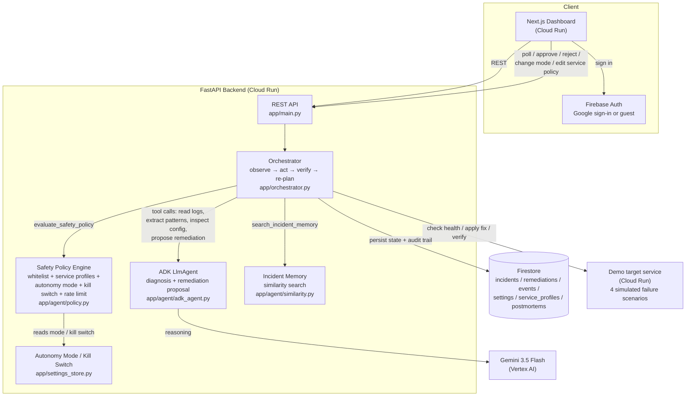

# Autonomous Incident Resolver Agent

> An autonomous AI agent that detects production incidents, investigates logs and
> service health, identifies likely root causes, proposes or performs safe
> remediation steps, and verifies recovery.

Built for the Google Cloud "All Things Agentic" hackathon — **Taskmaster** track.

The agent is not a log-summarizing chatbot. It runs a closed loop —
**observe → investigate → reason → act → verify → re-plan** — evaluated by a
Safety Policy Engine that combines a base action whitelist, per-service risk
profiles, a global autonomy mode, and a kill switch. It asks a human for
approval on anything above LOW risk (or everything, depending on the mode)
and never auto-executes anything outside the whitelist at all.

## Live demo

- Dashboard: https://incident-resolver-web-722901486266.us-central1.run.app (sign in with Google, or use guest mode)
- API: https://incident-resolver-api-722901486266.us-central1.run.app
- Target service (the thing the agent watches over): https://incident-demo-service-722901486266.us-central1.run.app

## Architecture



**Why this shape:** the LLM (via ADK) is only trusted to *diagnose* and
*propose* a remediation — it calls read-only tools (logs, config, error
pattern extraction) to gather evidence, then reports a structured
`{root_cause, confidence, severity, action, reason}`. Every decision about
whether that `action` is safe to run, whether it needs human approval, and
what to do if it fails is made deterministically by the Safety Policy Engine
(`app/agent/policy.py`) — the agent's own opinion of its action's risk is
never trusted, and the engine is the *only* place execution decisions are
made (orchestrator.py never checks risk directly).

## Repository layout

```
backend/          FastAPI + Google ADK agent + Firestore persistence
demo-service/      the "production service" the agent watches over — simulates
                    4 deterministic failure scenarios so the demo is reproducible
frontend/          Next.js dashboard — a small SRE operations center
```

## Dashboard

Six pages behind a sidebar:

- **Overview** — active/resolved/awaiting-approval counts, auto-fix rate, avg recovery time
- **Incidents** — live incidents + full history with service/status filters, incident detail (evidence, safety decision, approval, timeline)
- **Memory** — what the agent has learned: top root-cause categories, per-action remediation success rates, and a "similar past incidents" panel on each new diagnosis, drawn from both resolved AND failed/escalated incidents (deterministic word-overlap + same-service scoring, no embeddings)
- **Safety** — live autonomy mode + kill switch controls, plus how many actions were auto-executed, approved, rejected, or blocked
- **Services** — per-service risk profiles (criticality, environment, autonomy, allowed/approval-required actions, risk overrides)
- **Postmortems** — one grounded Gemini summary per resolved incident, generated on demand and cached

The root URL is a public Welcome page. From there you can either sign in
with Google (Firebase Auth — your name/email then appears in the audit
trail as who approved/rejected/changed what) or **continue as a guest**
with full read/write access to the dashboard, no auth required — useful
for quickly reviewing the live demo. Every dashboard page redirects back
to the Welcome page if you're neither signed in nor in guest mode.

## Safety model

The **Safety Policy Engine** (`backend/app/agent/policy.py`) is the single
place that decides what happens to a proposed action — it is never bypassed,
and the agent's own opinion of an action's risk is never trusted:

| Risk tier | Examples | Default behavior |
|---|---|---|
| LOW | retry_service, rerun_health_check, gather_logs | Auto-executed immediately |
| MEDIUM | restore_env_var, rollback_revision, fix_dependency_config | Requires human approval before running |
| HIGH / unknown | rotate_credentials, anything not whitelisted | **Never** auto-executed — incident is marked `escalation_required` for a human |

On top of the base tier, the engine also applies:
- **Autonomy mode** (global, `/settings`): Observe Only / Recommend Only (never execute), Approval Required (everything needs a human, even LOW), Autonomous Low-Risk (the table above).
- **Kill switch**: forces every action to require approval, regardless of mode — monitoring, investigation, and recommendations keep running.
- **Service risk profiles** (`/services/{id}`): per-service risk overrides, criticality/environment-based escalation (e.g. a LOW action becomes MEDIUM for a CRITICAL production service), an explicit approval-required action list, and a restricted "allowed automatic actions" list.
- **Execution rate limit**: the same action can only actually run twice per service in a 10-minute window; a 3rd attempt is blocked outright.

If a remediation is applied and verification shows the service still
unhealthy, the agent re-plans (tries the diagnosis again, excluding
previously-failed actions — enforced in the ADK tool itself, not just
prompted) up to a fixed attempt cap, after which it escalates to a human
rather than looping forever. Every remediation carries a full audit trail:
`approved_by`, `approved_at`, `executed_by`, `execution_id`,
`policy_decision`, `policy_reason`.

## Agent tools

Implemented in `backend/app/agent/tools.py`, wired into the ADK agent in
`backend/app/agent/adk_agent.py`:

- `check_service_health` / `verify_recovery` — health check (deterministic, called by the orchestrator, not the LLM)
- `read_recent_logs` — recent structured log entries from the target service
- `extract_error_patterns` — deterministic log-line grouping with a confidence score (no LLM)
- `inspect_service_config` — safe, non-secret config metadata
- `propose_remediation` (ADK tool, LLM-driven) — the agent's one required output: diagnosis + proposed action. Code-enforced (not just prompted) to never repropose an action already tried for this incident.
- `search_incident_memory` — the similarity search against past incidents (deterministic, not an LLM call)
- `evaluate_safety_policy` — the Safety Policy Engine's decision (see below)
- `apply_safe_remediation` — executes the action against the target service
- `save_incident_state` — persisted via `app/incidents_store.py` + `app/agent/activity_log.py`

Every incident records which of these actually ran (`Incident.tools_used`),
shown in the dashboard's Evidence panel, and every activity-log event
carries who/what performed it (`agent` / `human` / `safety_engine`).

## Demo scenarios

The target service (`demo-service/main.py`) simulates four deterministic
failure modes so the loop is reproducible for judging:

1. **Missing env var** — `DATABASE_URL` unset → fix: `restore_env_var` (MEDIUM, needs approval)
2. **Broken dependency** — upstream `payments-api` failing → fix: `fix_dependency_config` (MEDIUM, needs approval)
3. **Bad deployment** — new revision crash-looping → fix: `rollback_revision` (MEDIUM, needs approval)
4. **Credential exposure** — a service account key found in public logs → the agent correctly diagnoses this needs `rotate_credentials`, which is deliberately **not** on the safe-execute whitelist — the Safety Policy Engine blocks it outright and escalates to a human, without ever calling `apply_safe_remediation`. This is the one scenario that actually proves the "we never trust the model's own risk opinion" claim live, rather than by inspection.

None of the four map to a LOW-risk action, so approving/blocking is always
visible in the demo; LOW-risk auto-execution (`retry_service` etc.) is
exercised by the automated test suite and can be triggered directly via
`POST /incidents` if the target service is already healthy-but-flaky, but
isn't wired to a dedicated demo button yet.

## Running locally

Requires: Python 3.12+, Node 20+, a GCP project with Vertex AI + Firestore
enabled, and `gcloud auth application-default login` run once.

### 1. Demo service (the target)

```bash
cd demo-service
python -m venv venv && venv/Scripts/activate  # or source venv/bin/activate on macOS/Linux
pip install -r requirements.txt
uvicorn main:app --port 8080
```

### 2. Backend

```bash
cd backend
python -m venv venv && venv/Scripts/activate
pip install -r requirements.txt
cp .env.example .env   # edit GOOGLE_CLOUD_PROJECT to your project
uvicorn app.main:app --port 8000
```

### 3. Frontend

```bash
cd frontend
npm install
cp .env.local.example .env.local   # NEXT_PUBLIC_API_URL=http://localhost:8000
npm run dev -- -p 3002
```

Open http://localhost:3002, use guest mode or sign in with Google (the
Firebase config in `frontend/lib/firebase.ts` is a public client key —
`localhost` is pre-authorized, no local setup needed), click a scenario
button, and watch the agent investigate, propose a fix, and (after you
approve) verify recovery.

### Tests

```bash
cd backend
venv/Scripts/python.exe -m pytest tests/ -v
```

## Deployment (Cloud Run)

All three services are deployed independently. The demo service is pinned to
a single warm instance (`--min-instances=1 --max-instances=1`) since it holds
its simulated incident state in memory — this also means it does **not**
scale horizontally, so two people triggering scenarios at the same moment
share the same target and can race each other (see Known limitations).
The backend and frontend are also kept at `--min-instances=1` (no upper
cap) for the hackathon judging window, purely to avoid Cloud Run
cold-start latency on the first request after idle time — not required for
correctness, just for a snappier live demo.

```bash
# demo-service
cd demo-service
gcloud run deploy incident-demo-service --source . --region us-central1 \
  --allow-unauthenticated --min-instances=1 --max-instances=1

# backend (point DEMO_SERVICE_URL at the demo-service URL from above)
cd ../backend
gcloud run deploy incident-resolver-api --source . --region us-central1 \
  --allow-unauthenticated \
  --service-account incident-resolver-run@<PROJECT>.iam.gserviceaccount.com \
  --set-env-vars "GOOGLE_CLOUD_PROJECT=<PROJECT>,GOOGLE_CLOUD_LOCATION=global,GEMINI_MODEL=gemini-3.5-flash,DEMO_SERVICE_URL=<demo-service-url>,ALLOWED_ORIGINS=<frontend-url>"

# frontend (NEXT_PUBLIC_API_URL must be baked in at build time)
cd ../frontend
gcloud builds submit --config cloudbuild.yaml \
  --substitutions "_API_URL=<backend-url>,_IMAGE=<artifact-registry-image>"
gcloud run deploy incident-resolver-web --image <artifact-registry-image> \
  --region us-central1 --allow-unauthenticated
```

> **Before deploying:** run `gcloud config get-value project` and confirm it
> matches this project. If you (or another `gcloud` session on the same
> machine) work on more than one GCP project, the active project can get
> switched out from under you — every command above then silently runs
> against the wrong project's Cloud Build / Artifact Registry, which
> surfaces as a confusing `artifactregistry.repositories.uploadArtifacts`
> permission-denied error that no amount of IAM-granting fixes. Pass
> `--project=<PROJECT>` explicitly if in doubt.

Auth is ADC end-to-end via the `incident-resolver-run` service account
(`roles/datastore.user`, `roles/aiplatform.user`) — no API keys anywhere.
Gemini runs through Vertex AI; `GOOGLE_CLOUD_LOCATION=global` is required
because `gemini-3.5-flash` is not yet served in regional endpoints
like `us-central1`.

## Security notes

Two things are **intentionally** open in this deployment, both for the same
reason — a hackathon judge should be able to try the live demo in seconds,
with no setup:

- **The demo service's admin endpoints** (`/admin/incidents/trigger|resolve|reset`)
  have no authentication. It only ever mutates its own in-memory simulated
  state — it is not a real production system, and there is nothing behind it
  to protect.
- **The backend's write endpoints** (approve/reject, autonomy mode, kill
  switch, service policy) run in `DEMO_MODE=true` by default, which trusts
  the actor name a caller claims in the request body — this is what makes
  guest mode work with no backend account system. Setting `DEMO_MODE=false`
  switches every one of those endpoints to require a valid Firebase ID token
  (`Authorization: Bearer <token>`) instead, verified server-side via
  `firebase-admin` (`backend/app/auth.py`); the actor is then the verified
  token's identity, never anything the client claims. The frontend already
  attaches a real ID token to every write request whenever a Firebase user
  is signed in, so flipping the flag needs no frontend changes.

## Known limitations

- **The demo target is a single shared instance.** If two people trigger
  scenarios at the same moment, the second `trigger` call gets a clean 400
  ("an incident is already active") rather than silently racing — but it
  does mean only one demo can be "in flight" globally at a time. Click
  Reset if the demo service seems stuck on someone else's test run.
- **None of the 4 demo scenarios exercise LOW-risk auto-execution** (they're
  all MEDIUM or intentionally-blocked HIGH) — the "LOW risk runs
  automatically, no approval needed" claim is proven by the test suite and
  can be triggered directly via the API, but there's no dashboard button
  for it yet.
- **The approve/reject race window across multiple Cloud Run instances is
  not closed with a Firestore transaction** — within a single instance,
  Firestore's blocking calls happen to serialize concurrent requests, but a
  second instance (Cloud Run can scale the backend beyond one) reading the
  same remediation before the first instance's write lands is a real,
  narrow possibility. Not expected to surface during a single-presenter
  live demo.

## What this is not

This agent does not provide legal, financial, or operational advice beyond
what it can ground in the logs and configuration it actually reads. It never
auto-executes an action outside the safety whitelist, and any action outside
that whitelist always routes to a human instead of being attempted.
